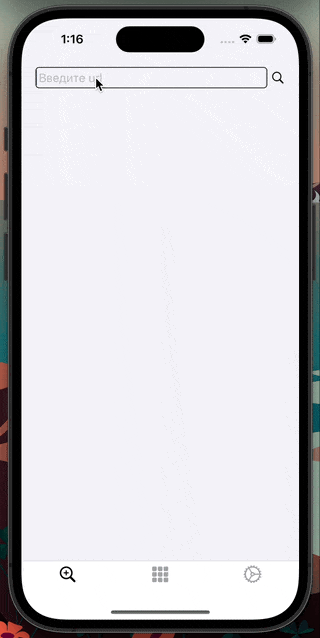

## Хранилище картинок

### Стек технологий: Swift, UIKit, верстка кодом, VIPER, Clean Architecture

  

<h2> Функции </h2>

+ [x]  ***Загрузка картинки по URL***

+ [x]  ***Отображение картинок в виде коллекции***

+ [x] ***Карусель картинок*** 

+ [x] ***Зашифрованное хранилище картинок в FileManager*** 

+ [x] ***Обработка изображения***

+ [x] ***DeepLink***

+ [x] ***Локальные пуши***

+ [x] ***Менеджер цветовой схемы*** 

